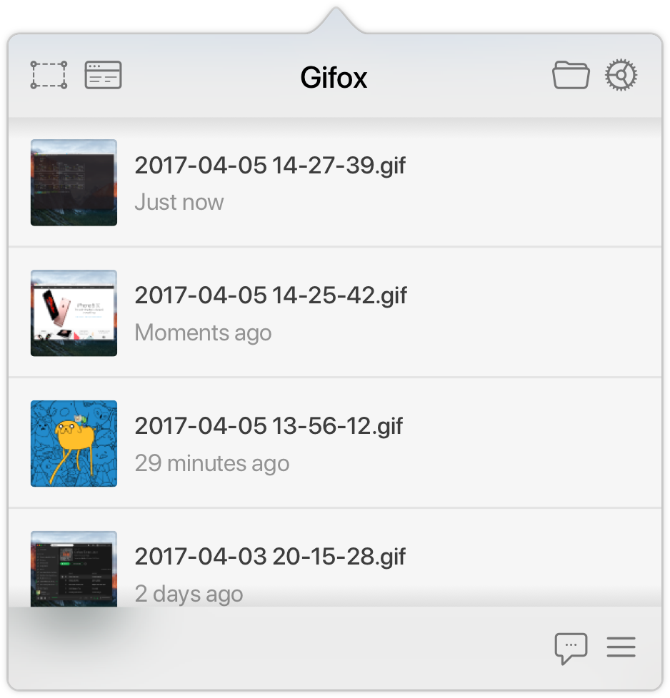
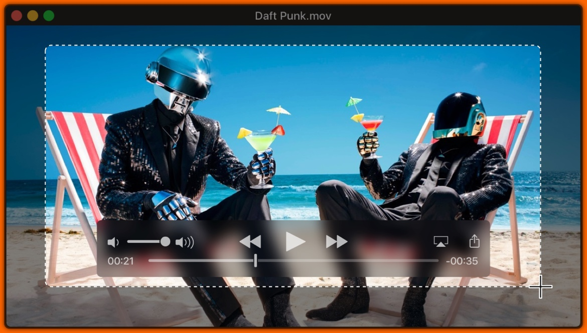
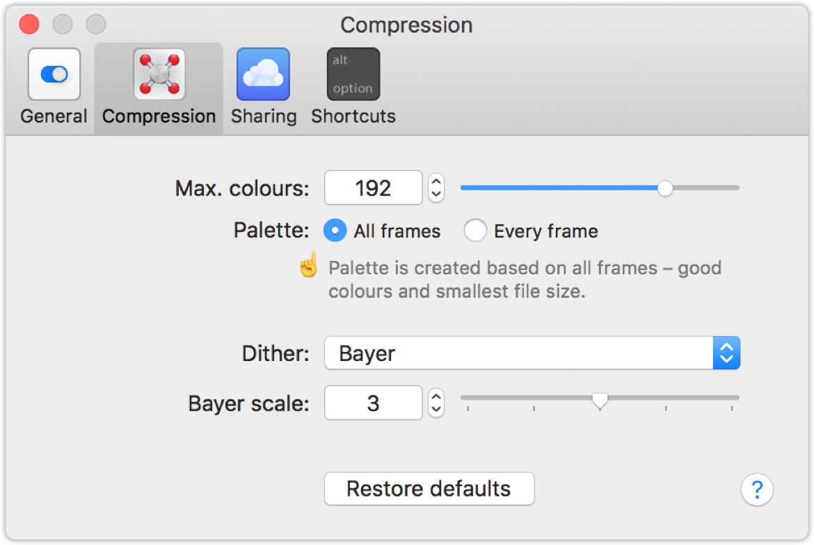
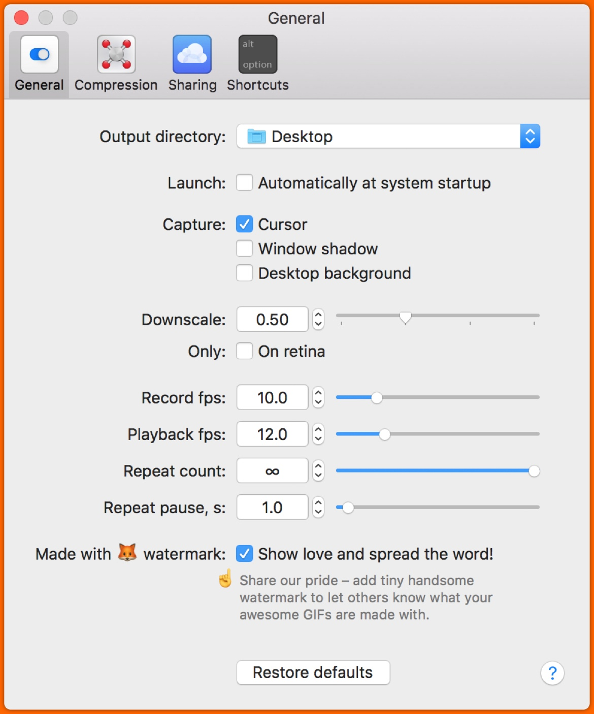
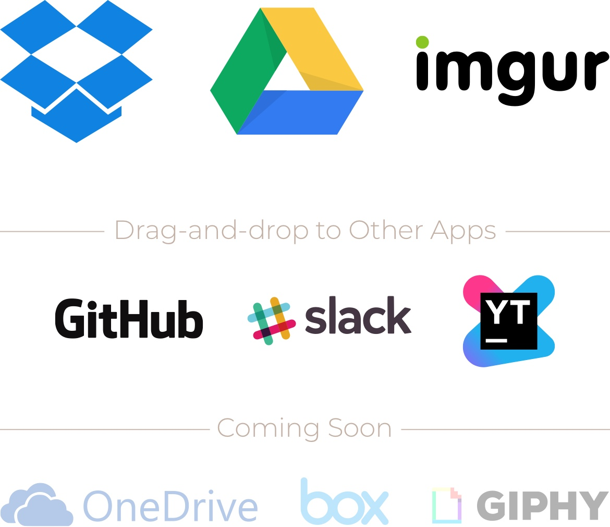

# Gifox

If we need to create some GIF from your screen recording, we can use [Gifox](https://gifox.io/).


It is also available from `Homebrew`: `brew cask install gifox` 


You will find it in application, open it, and It will appear in your top menu bar: 

We can use free or window selection: 

We have advanced compression options:

We can decide what to record, how to record it:

We ca easily share your captured GIFs with Dropbox, Google Drive and Imgur, copy or drag-and-drop them to other apps!

