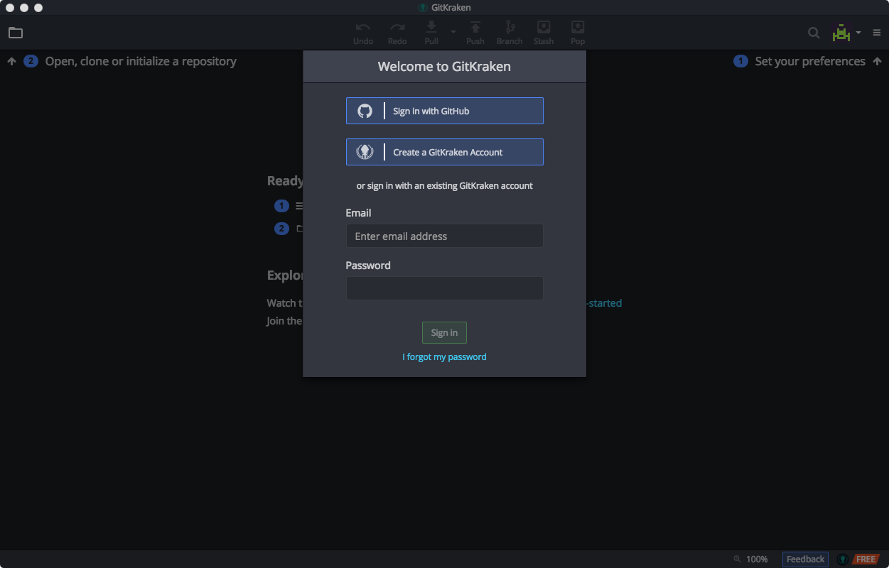

# GitKraken

## Installation

You can also install `GitKraren` from `Hombrew Cask:`

`brew cask install gitkraken`

You'll find GitKraken in your Applications folder. Open it and it looks like this: 

If you have a GitHub account you can use it to Sing in to GitKraken. Otherwise Create a GitKraken Account. 

## Configure

Now you can go in the preferences panel and activate the use of ssh-agent. Using the ssh-agent GitKraken can automatically connect to your GitHub or BitBucket accounts.

## More resources 



