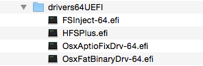

# Prepare USB Drive

## Before start

Prior to installing OS X, it is a good idea to create an OEM recovery USB from Windows. If anything goes wrong and you want/need to get back to Windows, you can restore it via the USB. Use the utility provided by HP to accomplish this.

### **Installing Clover to USB**

You must determine what the disk identifier is. With the USB plugged in to the computer, use 'diskutil list':  


```bash
diskutil list 
/dev/disk0 (internal, physical):
   #:                       TYPE NAME                    SIZE       IDENTIFIER
   0:      GUID_partition_scheme                        *500.1 GB   disk0
   1:                        EFI EFI                     209.7 MB   disk0s1
   2:                  Apple_HFS 10.10.x                 80.0 GB    disk0s2
   3:                  Apple_HFS 10.11.gm1               80.0 GB    disk0s3
   4:       Microsoft Basic Data Win10_TP                79.4 GB    disk0s4
   5:                  Apple_HFS 10.10.test              80.0 GB    disk0s5
[B]/dev/disk1 (external, physical):
   #:                       TYPE NAME                    SIZE       IDENTIFIER
   0:                                                   *8.0 GB     disk1[/B]

```


So I can see that the USB is at /dev/disk1. Be careful with diskutil as you can lose data without a mechanism for recovery if you repartition the wrong disk.


Now you can format the USB drive with:

```bash
# repartition /dev/disk1 GPT, one partition
# EFI will be created automatically
# second partition, "install_osx", HFS+J, remainder
diskutil partitionDisk /dev/disk1 1 GPT HFS+J "install_osx" R
```

The output of the operation looks like:

```bash
Started partitioning on disk1
Unmounting disk
Creating the partition map
Waiting for the disks to reappear
Formatting disk1s2 as Mac OS Extended (Journaled) with name install_osx
Initialized /dev/rdisk1s2 as a 7 GB case-insensitive HFS Plus volume with a 8192k journal
Mounting disk
Finished partitioning on disk1
/dev/disk1 (external, physical):
   #:                       TYPE NAME                    SIZE       IDENTIFIER
   0:      GUID_partition_scheme                        *8.0 GB     disk1
   1:                        EFI EFI                     209.7 MB   disk1s1
   2:                  Apple_HFS install_osx             7.7 GB     disk1s2
```

Now you need to install clover on the drive: Download [https://github.com/RehabMan/Clover](https://github.com/RehabMan/Clover) and run the Clover Installer package: 

* select the target of the install to "install\_osx" using "Change Install Location"
* select "Customize"
* check "Install for UEFI booting only", "Install Clover in the ESP" will automatically select
* check "BGM" from Themes
* check "OsxAptioFixDrv-64" from Drivers64UEFI

After making your selections you can continue to "Install" the Clover bootloader to your USB.  
Finally, we need one EFI driver not included in the Clover installer, HFSPlus.efi.  
It can be downloaded from here: [https://github.com/JrCs/CloverGrowerPro/raw/master/Files/HFSPlus/X64/HFSPlus.efi](https://github.com/JrCs/CloverGrowerPro/raw/master/Files/HFSPlus/X64/HFSPlus.efi).  
Copy it to /EFI/Clover/drivers64UEFI


Please, **DO NOT forget HFSPlus.efi**. Without it, you won't see any HFS+ partitions, including the HFS+ partition that the OS X installer is on.


If you're installing High Sierra \(10.13\) to an SSD, keep in mind that the file system will be APFS, which requires apfs.efi in drivers64UEFI. Without **apfs.efi in drivers64UEFI, Clover will not recognize APFS** boot volumes. You can find apfs.efi at /usr/standalone/i386/apfs.efi inside of "/Applications/Install macOS High Sierra.app/Contents/SharedSupport/BaseSystem.dmg".

Now you have the Clover bootloader on the USB, but you still need to configure it correctly.

The resulting drivers64UEFI should look something like this:




