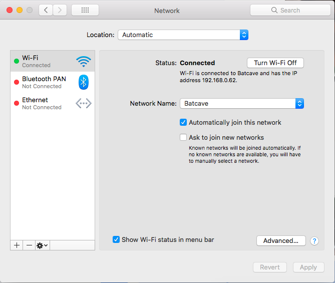
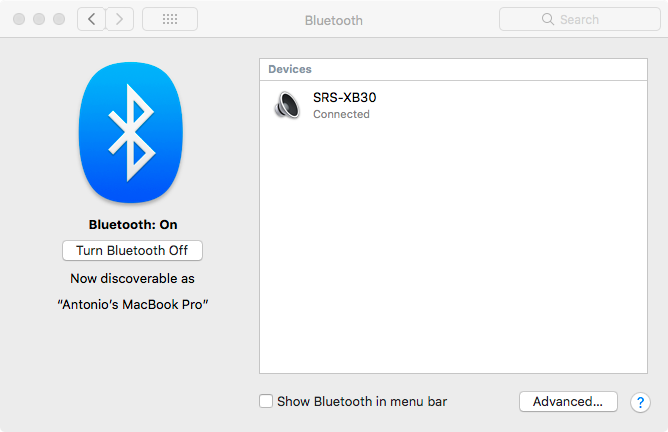

# WiFi and Bluetooth PCI device

Since my laptop use a PCI WiFi and Bluetooth device that is not compatible with MacOSX i decided to buy a compatible one. 

After switch the devices, restarting the computer, both Wifi and Bluetooth are working _magically_ without installing anything. 

