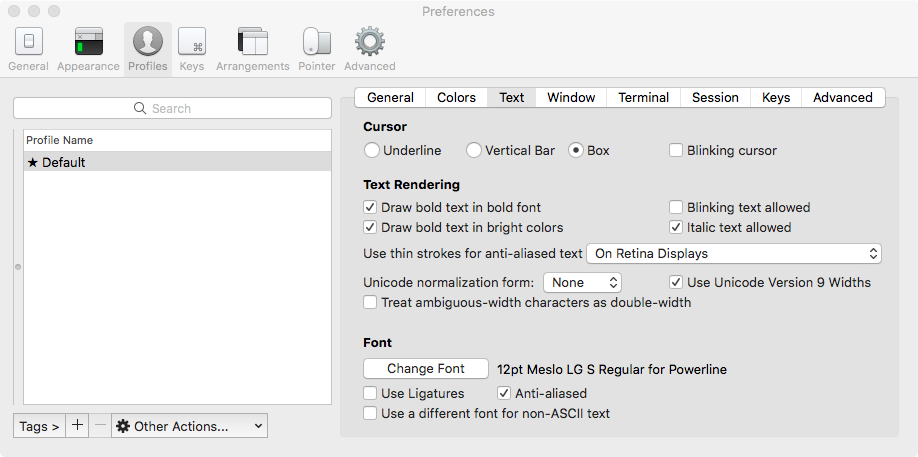
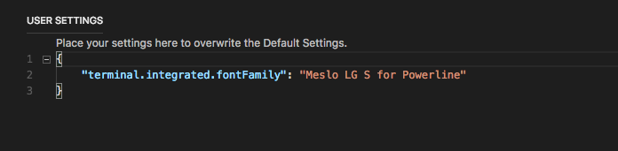
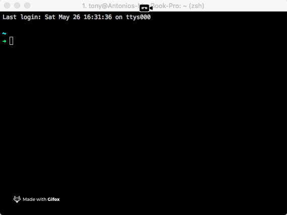

# iTerm2

[iTerm2](http://www.iterm2.com/) is an open source replacement for Apple's Terminal. It's highly customizable and comes with a lot of useful features.

## Installation

You can get the app from [iTerm2 downloads page](http://www.iterm2.com/downloads.html). Once downloaded, drag and drop the **iTerm**application file into your **Applications** folder.


Instead of downloading and installing iTerm2 manually, you can use `Homebrew` `brew cask install iterm2`


## Customization

We are going to setup [spaceship-prompt](https://github.com/denysdovhan/spaceship-prompt)

The final setup will be like this:


### 

### Requirements

For correct work you will first need:

* [`zsh`](http://www.zsh.org/) \(v5.0.6 or recent\) must be installed.
* [Powerline Font](https://github.com/powerline/fonts) must be installed and used in your terminal.

### Install zsh

The Z shell \(also known as `zsh`\) is a Unix shell that is built on top of `bash` \(the default shell for macOS\) with additional features. It's recommended to use `zsh` over `bash`. It's also highly recommended to install a framework with `zsh` as it makes dealing with configuration, plugins and themes a lot nicer.

We've also included an `env.sh` file where we store our aliases, exports, path changes etc. We put this in a separate file to not pollute our main configuration file too much. This file is found in the bottom of this page.

Install `zsh` using Homebrew:

```text
$ brew install zsh
```

Now you should install a framework, we'll use [Oh My Zsh](https://github.com/robbyrussell/oh-my-zsh).

The configuration file for `zsh` is called `.zshrc` and lives in your home folder \(`~/.zshrc`\).

### Oh My Zsh {#oh-my-zsh}

[Oh My Zsh](https://github.com/robbyrussell/oh-my-zsh) is an open source, community-driven framework for managing your `zsh` configuration. It comes with a bunch of features out of the box and improves your terminal experience.

Install `Oh My Zsh`:

```bash
sh -c "$(curl -fsSL https://raw.githubusercontent.com/robbyrussell/oh-my-zsh/master/tools/install.sh)"
```

The installation script should set `zsh` to your default shell, but if it doesn't you can do it manually:

```bash
chsh -s $(which zsh)
```

#### Configuration

The out-of-the-box configuration is usable but you probably want to customise it to suit your needs. The [Official Wiki](https://github.com/robbyrussell/oh-my-zsh/wiki) contains a lot of useful information if you want to deep dive into what you can do with Oh My Zsh, but we'll cover the basics here.

To apply the changes you make you need to either **start new shell instance** or run:

```bash
source ~/.zshrc
```

#### **Plugins**

Add plugins to your shell by adding the name of the plugin to the `plugin` array in your `.zshrc`.

```bash
plugins=(git colored-man colorize brew osx zsh-syntax-highlighting)
```

You'll find a list of all plugins on the [Oh My Zsh Wiki](https://github.com/robbyrussell/oh-my-zsh/wiki/Plugins). Note that adding plugins can cause your shell startup time to increase.

### Font Setup

To use `spaceship`we need to setup `Powerline Fonts`. To do it open a new terminal and exec the following commands:

```bash
# clone poweline fonts repo
git clone https://github.com/powerline/fonts.git --depth=1
# install it 
cd fonts/
./install.sh
# clean-up a bit
cd ..
rm -rf fonts/
```

#### Setting fonts in iTerm2

 In Preferences &gt; Profiles &gt; Text and select the fonts:




Installing a patched font will mess up the integrated terminal in `Visual Studio Code` unless you use the proper settings. You'll need to go to settings \(`CMD + ,`\) and add or edit the following values:

* for Source Code Pro: `"terminal.integrated.fontFamily": "Source Code Pro for Powerline"`
* for Meslo: `"terminal.integrated.fontFamily": "Meslo LG M for Powerline"`
* for other fonts you'll need to check the font name in Font Book.

You can also set the font size e.g.: `"terminal.integrated.fontSize": 14`




### We can finally install Spaceship 

In the terminal run:

```bash
# clone spaceship repo in the themes folder of zsh
git clone https://github.com/denysdovhan/spaceship-prompt.git "$ZSH_CUSTOM/themes/spaceship-prompt"
# link the folder 
ln -s "$ZSH_CUSTOM/themes/spaceship-prompt/spaceship.zsh-theme" "$ZSH_CUSTOM/themes/spaceship.zsh-theme"
```

Now open ~/.zshrc and replace ZSH\_THEME="robbyrussell" with ZSH\_THEME="spaceship"

Restart iTerm2 and at this point you should have a result like this: 



You can find the official spaceshipt-prompt documentation on  Gitbook here: [https://denysdovhan.com/spaceship-prompt/](https://denysdovhan.com/spaceship-prompt/)

