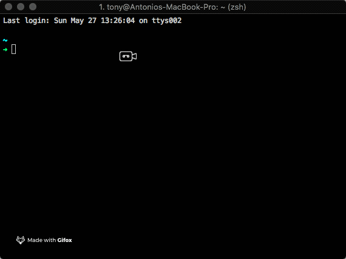
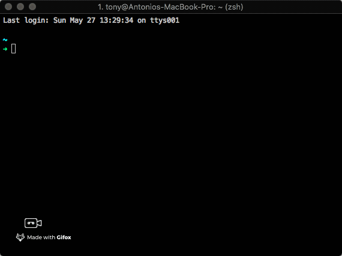

# Plugins

Now is time to setup some useful plugins for iTerm.

## zsh-autosuggestions

[_Fish_](http://fishshell.com/)_-like fast/unobtrusive autosuggestions for zsh._

It suggests commands as you type, based on command history. This is my favourite plugin, it will save you a lot of time spent in typing commands in our terminal.

### Installing with Oh My Zsh

1. Clone [this](https://github.com/zsh-users/zsh-autosuggestions) repository into `$ZSH_CUSTOM/plugins` \(by default `~/.oh-my-zsh/custom/plugins`\)

   ```bash
   git clone https://github.com/zsh-users/zsh-autosuggestions ${ZSH_CUSTOM:-~/.oh-my-zsh/custom}/plugins/zsh-autosuggestions
   ```

2. Add the plugin to the list of plugins for Oh My Zsh to load \(open `~/.zshrc`\):

   ```text
   plugins=(zsh-autosuggestions)
   ```

3. Start a new terminal session.



For other types of installation go [here](https://github.com/zsh-users/zsh-autosuggestions/blob/master/INSTALL.md).

## Syntax highlighting

This package provides syntax highlighting for the shell zsh. It enables highlighting of commands whilst they are typed at a zsh prompt into an interactive terminal. This helps in reviewing commands before running them, particularly in catching syntax errors.

### Installing with Oh My Zsh

1. Clone this repository in oh-my-zsh's plugins directory:

   ```bash
    git clone https://github.com/zsh-users/zsh-syntax-highlighting.git ${ZSH_CUSTOM:-~/.oh-my-zsh/custom}/plugins/zsh-syntax-highlighting
   ```

2. Activate the plugin in `~/.zshrc`:

   ```bash
    plugins=( [plugins...] zsh-syntax-highlighting)
   ```

3. Source `~/.zshrc` to take changes into account:

   ```bash
    source ~/.zshrc
   ```

## Enable natural text selection

By default, word jumps \(`option + →` or `option + ←`\) and word deletions \(`option + backspace`\) do not work. 

To enable these, go to "iTerm =&gt; Preferences =&gt; Profiles =&gt; Keys =&gt; Load Preset... =&gt; Natural Text Editing"



## How to Customize Your Command Prompt

For further customisation of your prompt, you can follow a great guide here: [https://code.tutsplus.com/tutorials/how-to-customize-your-command-prompt--net-24083](https://code.tutsplus.com/tutorials/how-to-customize-your-command-prompt--net-24083)

## List of useful plugin for development

```bash
# Which plugins would you like to load? (plugins can be found in ~/.oh-my-zsh/plugins/*)
# Custom plugins may be added to ~/.oh-my-zsh/custom/plugins/
# Example format: plugins=(rails git textmate ruby lighthouse)
# Add wisely, as too many plugins slow down shell startup.
plugins=(
  git
  git-flow
  colored-man-pages
  colorize
  github
  jira
  node
  nvm
  nvm-auto
  vagrant
  virtualenv
  pip
  python
  brew
  osx
  zsh-autosuggestions
  zsh-nvm
  zsh-syntax-highlighting
)
```

## NVM auto switch node version 

```bash
export NVM_DIR="/Users/tony/.nvm"
[ -s "$NVM_DIR/nvm.sh" ] && . "$NVM_DIR/nvm.sh"  # This loads nvm

nvm_auto_switch
export PATH="/usr/local/opt/imagemagick@6/bin:$PATH"
```

## Android env variables

```bash
export ANDROID_HOME=$HOME/Library/Android/sdk
export PATH=$PATH:$ANDROID_HOME/tools
export PATH=$PATH:$ANDROID_HOME/tools/bin
export PATH=$PATH:$ANDROID_HOME/platform-tools
export PATH=$PATH:$ANDROID_HOME/emulator
```

## Others: ruby rvn and NPM\_TOKEN

```bash
if which rbenv > /dev/null; then eval "$(rbenv init -)"; fi
export PATH="/usr/local/opt/mariadb@10.2/bin:$PATH"

# Add RVM to PATH for scripting. Make sure this is the last PATH variable change.
export PATH="$PATH:$HOME/.rvm/bin"
export NPM_TOKEN="YOUR NPM TOKEN"
```


