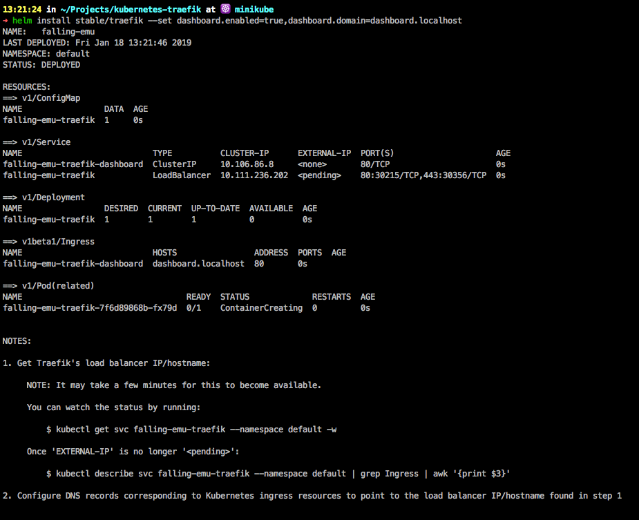

# K8S with Traefik as IC

To set up Traefik, copy / paste the following command line:

```bash
helm install --name=traefik --set rbac.enabled=true,dashboard.enabled=true,dashboard.domain=dashboard.localhost stable/traefik
```

In the above command line, we enabled the dashboard \(_`dashboard.enabled=true`_\) and made it available on [http://dashboard.localhost](http://dashboard.localhost/) \(_`dashboard.domain=localhost.domain`_\).

The output of the helm install command line will look like:



Unfortunately in my case the status of the load balancer ip get stuck at pending, i googled it but without lucky.

So i decided to remove the Traefik helm chart:

```bash
helm ls --short | xargs -L1 helm delete
```

Since i tried to do some stuff to fix the error, to be sure that everything be reset i run:

```bash
minikube delete && minikube start
```

Even if it might not seems, the official documentation of Traefik with Kubernetes is very well detailed and explained. So i decided to try again without Helm.

### Traefik user guide &gt; Kubernetes

To follow the tutorial I can advise to stay focused on the DaemonSet object. 





