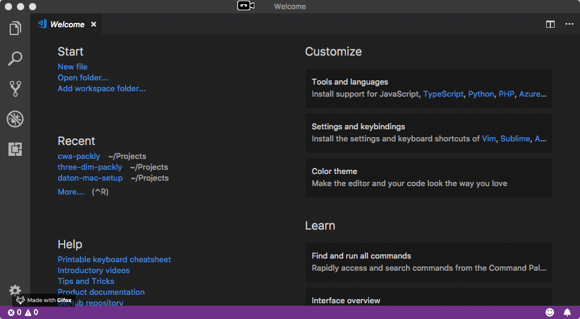
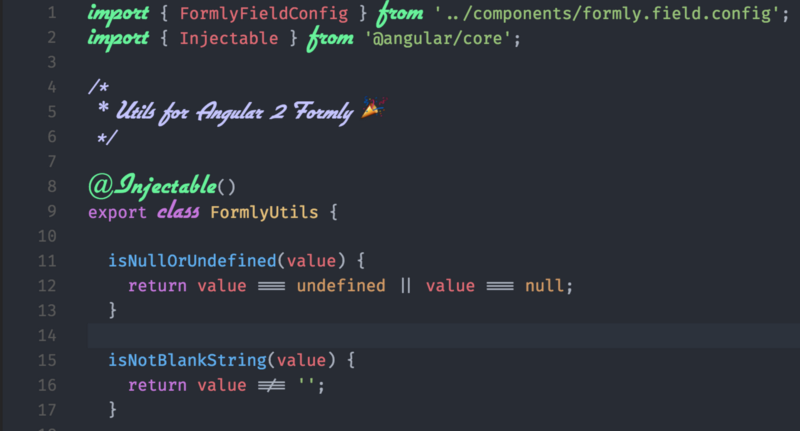
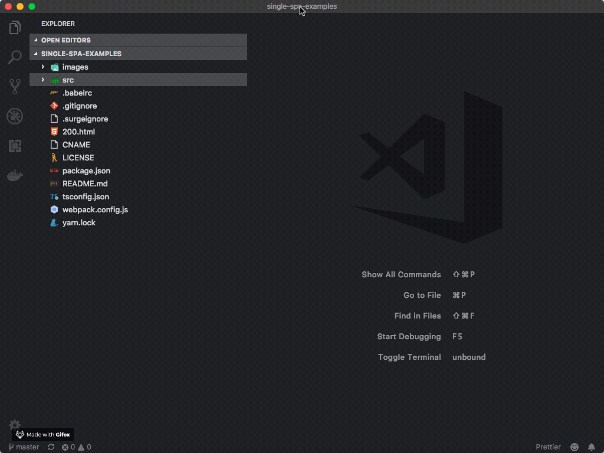
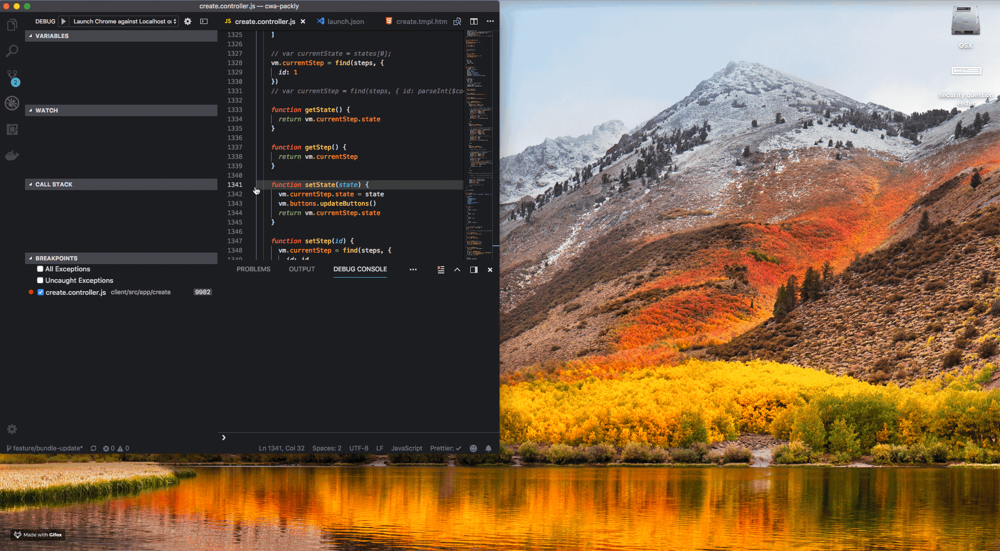

# VS Code

## Installation

You can get `Visual Studio Code` from his [official site](https://code.visualstudio.com/). Once downloaded, drag and drop the application file into your **Applications** folder.


Instead of downloading and installing `VSCode` manually, you can use `Homebrew` `brew cask install visual-studio-code`


## Installation of useful extensions

Enable the `VSCode CLI` opening VSCode and click `CMD + Shift + P` to open the command tool and type: `Install command`



Now open a terminal window and type: 

```bash
code --install-extension EditorConfig.EditorConfig
code --install-extension codezombiech.gitignore
code --install-extension dbaeumer.vscode-eslint
code --install-extension esbenp.prettier-vscode
code --install-extension steoates.autoimport
code --install-extension wix.vscode-import-cost
code --install-extension robertohuertasm.vscode-icons
code --install-extension dustinsanders.an-old-hope-theme-vscode
```

## Installation of a Font

We are following the article [Multiple Fonts: Alternative to Operator Mono in VSCode](https://medium.com/@zamamohammed/multiple-fonts-alternative-to-operator-mono-in-vscode-7745b52120a0)

1. Download and install both [FiraCode](https://github.com/tonsky/FiraCode) and [FlottFlott](http://www.dafont.com/flottflott.font) \(or another cursive alternative if you want\)
2. Install VSCode Extension: [Custom CSS and JS Loader](https://marketplace.visualstudio.com/items?itemName=be5invis.vscode-custom-css)
3. Save [styles.css](https://gist.githubusercontent.com/mohammedzamakhan/03be8cb8bcab53b09772db4d09b7d32e/raw/6d86ae0b78c54810130091304c51e8614f4f4199/styles.css) on your desktop
4. Update the User settings \([settings.json](https://gist.githubusercontent.com/mohammedzamakhan/e8f10b5d759c01e1b9d7de7bccc3832c/raw/538b4e4b4d44af31e1b8ac3420f884d84c3d139b/settings.json)\) in VSCode. **\(note: don’t forget to change the path “ vscode\_custom\_css.imports”\)**

```javascript
// Place your settings in this file to overwrite the default settings
{
    "editor.fontFamily": "Fira Code",
    "editor.fontLigatures": true,
    "vscode_custom_css.imports": ["file:///Users/daton/Desktop/styles.css"]
}
```

Replace your User from the path of custom css import.



## Debug Front-end Application with Chrome Debugging for VS Code

Chrome Debugger allows front-end developers to debug their client-side JavaScript code running inside Google Chrome directly from Visual Studio Code.

### To get started {#_to-get-started}

To get started, open the **Extensions** view \(⇧⌘X\). When the extension list appears, type 'chrome' to filter the list and install the `Debugger for Chrome` extension. You'll then create a launch-configuration file which is explained in detail in the README [right here](https://github.com/Microsoft/vscode-chrome-debug).

You can either setup VS Code to connect to an already running Chrome instance or simply start a new one with remote debugging enabled, but read more about that in our [README](https://github.com/Microsoft/vscode-chrome-debug).

### Supported features {#_supported-features}

Support for the following features:

* Setting breakpoints, including within source files when source maps are enabled
* TypeScript, via source maps
* Stepping, including using the buttons on the Chrome page
* Locals scope variables via the VS Code Locals pane
* Debugging eval scripts, script tags, and scripts that are added dynamically
* Watches via the VS Code Watch panel.
* The debug console
* Most console APIs

### Configuration

Press `Cmd + Shift + P` to open the VS Code command prompt and type `launch` and `Open launch.json` and then select `Chrome` environment:  



  
If your Front-end application run on port 3000 you can use the following configuration: 

```javascript
{
    // Use IntelliSense to learn about possible attributes.
    // Hover to view descriptions of existing attributes.
    // For more information, visit: https://go.microsoft.com/fwlink/?linkid=830387
    "version": "0.2.0",
    "configurations": [
       {
           "type": "chrome",
           "request": "launch",
           "name": "Launch Chrome against Localhost on port 3000",
           "url": "http://localhost:3000",
           "webRoot": "${workspaceFolder}/client/src"
       }
}
```

Set the `webRoot` folder with the proper path.

### Executing the Debugger 

Create a Breakpoint in you source code.

Press `Cmd + Shift + D` to open the `Debug Sidenav`. On the top left of `VS Code` we'll find the Play Button with `Launch Chrome against Localhost...`

A new Chrome window with debugger mode enabled will appear on our screen. 



{% embed data="{\"url\":\"https://code.visualstudio.com/blogs/2016/02/23/introducing-chrome-debugger-for-vs-code?WT.mc\_id=vscodecandothat-dotcom-team\",\"type\":\"link\",\"title\":\"Introducing Chrome Debugging for VS Code\",\"description\":\"Chrome debugger extension for Visual Studio Code\",\"icon\":{\"type\":\"icon\",\"url\":\"https://code.visualstudio.com/favicon.ico\",\"width\":128,\"height\":128,\"aspectRatio\":1},\"thumbnail\":{\"type\":\"thumbnail\",\"url\":\"https://code.visualstudio.com/opengraphimg/opengraph-blog.png\",\"width\":1223,\"height\":630,\"aspectRatio\":0.5151267375306623}}" %}

## More resources 




